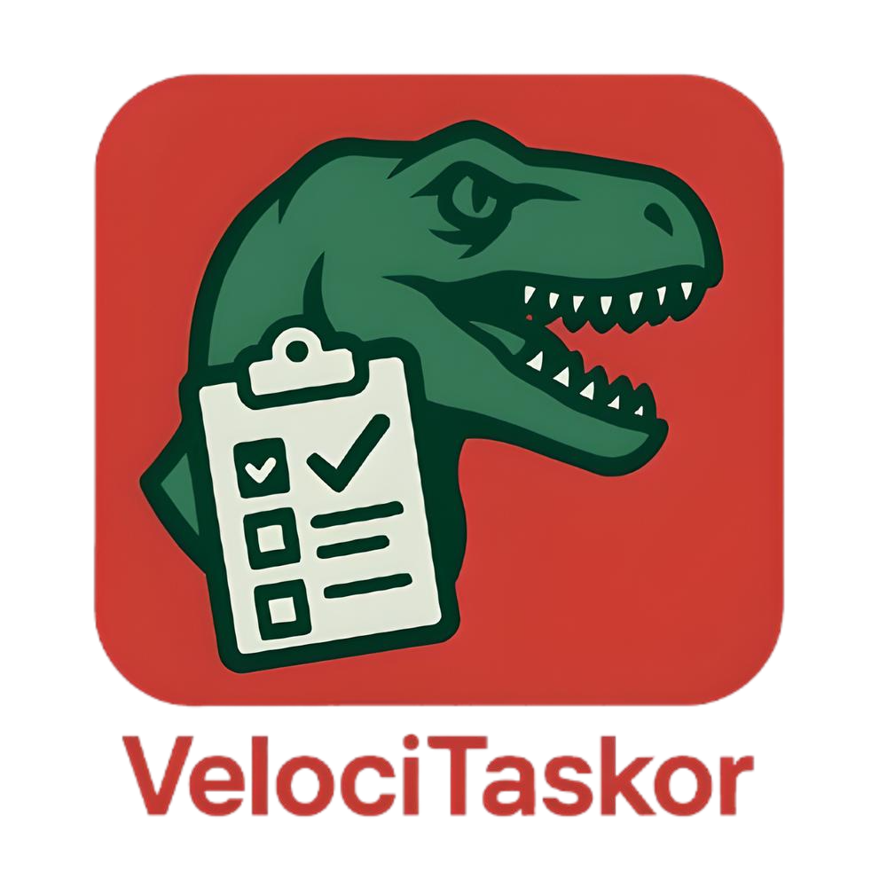

# VelociTaskor



A desktop task management application with tabbed organization, built with Python and Kivy.

## Key Features

- 🏷️ **Tab-based organization** with customizable colors
- 📝 **Task editor** with fields for:
  - Project
  - Task description
  - Owner
  - Status (BACKLOG, IN PROGRESS, DONE, BLOCKED)
  - Date
  - Notes
- 🔔 **Notification system** for important tasks
- 🔄 **Automatic data persistence**
- 📊 **Column sorting** with single click
- 🎨 **Customizable UI**:
  - Double-click tab names to edit title and color
  - Dynamic background colors based on selected tab

## System Requirements

- Python 3.7+
- Kivy 2.0.0+

## Installation

1. Clone the repository:
   ```bash
   git clone https://github.com/yourusername/VelociTaskor.git
   cd VelociTaskor
   ```
2. Install dependencies:
   ```bash
   pip install -r requirements.txt
   ```
3. Run the application:
   ```bash
   python main.py
   ```
4. Create stand-alone application:
   ```bash
   pyinstaller --onefile --windowed --icon=images/VelociTaskorIcon.png --add-data "images/VelociTaskorIcon.png:images/" --add-data "libs/*:libs/" \main.py
   ```

## Usage
### Tabs
- New Tab: Click "New Tab" in the bottom control panel
- Delete Tab: Click "Delete Tab" (cannot delete last remaining tab)
- Edit Tab: Double-click the tab name

### Tasks
- New Task: Click "New Task"
- Delete Task: Select a row and click "Delete Task"
- Edit Task: Click any field to edit
- Notifications: Toggle with the switch in the NOTIFY column

### Sorting
Click any column header to sort tasks (repeated click reverses order)

## Data Structure
Data is saved in JSON format at:

- Windows: %LOCALAPPDATA%\VelociTaskor\velocitaskor_data.json
- macOS: ~/Library/Application Support/VelociTaskor/velocitaskor_data.json
- Linux: ~/.local/share/VelociTaskor/velocitaskor_data.json

## License
Distributed under the MIT License